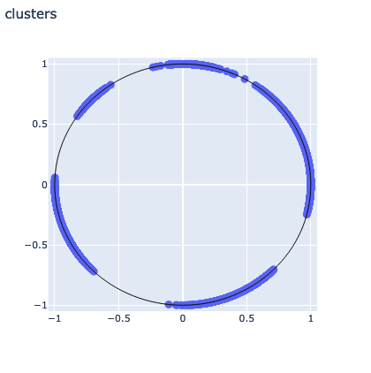
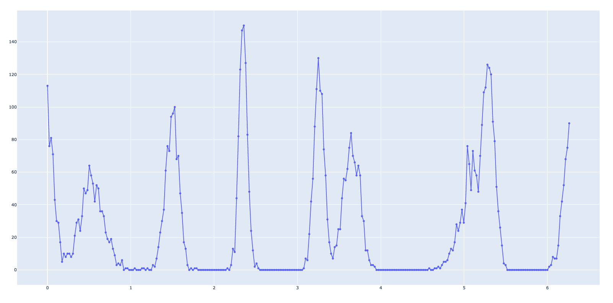
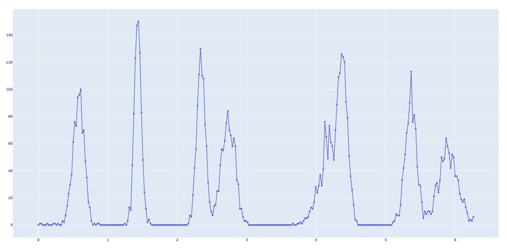
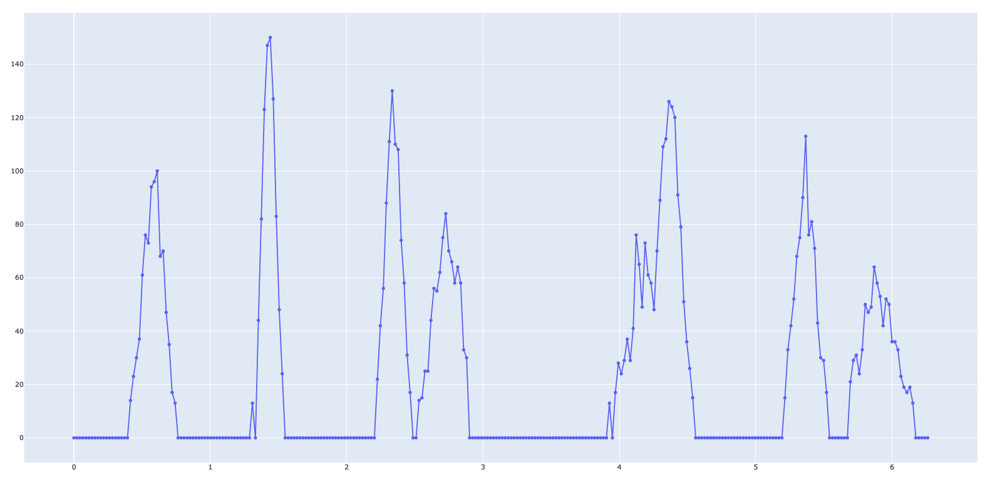
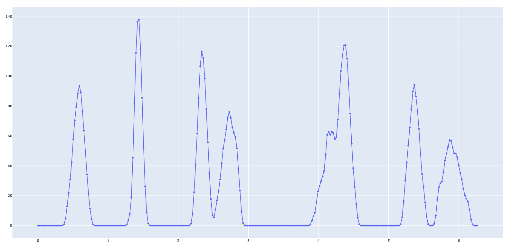
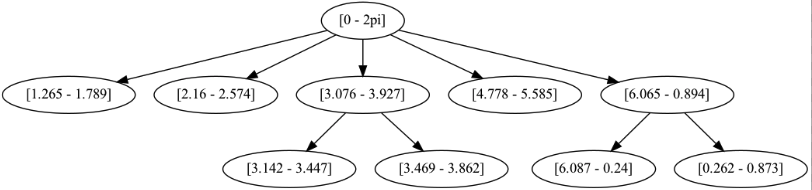
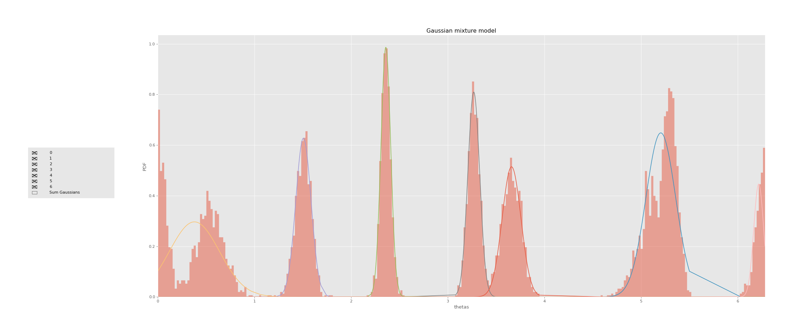

# Circle Clustering

## New Features
- [added rotation](#rotation)
- [removal of deep low noise](#removal)
- [Gaussian smoothing with KDE(in progress)](#smoothing)
- [new graph labeled](#graph)
- [Mixture of Gaussians](#mixture)
- [TODO -> discretization in the range [0,2pi]](#discretization)

## Pipeline
&rarr; The algorithm of takes the dataset as input and produces, through circle clustering, a set of values associated with the initial samples of the dataset.
Each initial sample is associated with a theta value in circular space [0.2pi].

&rarr; The theta values are discretized and positioned on a line segment, grouped into bins, to form a histogram

## Rotation
&rarr; Since the values are in the space [0, 2pi], and since this space is circular, some clusters may be positioned between the end of the segment and its beginning, as in the image above. It is necessary to ensure that this does not happen, otherwise the algorithm based on the hierarchical search in a tree could return one more or less cluster.
Therefore the first necessary step is to rotate our histogram

## Removal
&rarr; One of the fundamental problems of the hierarchical algorithm is the number of clusters in the lower levels, that is, all those small peaks that show up just above the base of the segment, which can be seen as simple noise. These must be eliminated, as simple smoothing cannot remove them. A rather functional heuristic is to calculate the average of the sums of each pair of values in succession. That is to add together all the differences in height that follow one another in the histogram. Once this value has been found, it is possible to eliminate everything below it, as compared to the previous peaks, it will not be useful, and will only dirty the data.

## Smoothing
&rarr; Removing background noise is not enough, many times the peaks are too dirty to be evaluated, so it is useful to smooth the data globally. A useful technique for smoothing a histogram is Kernel Density Estimation (KDE). Once the width of the smoothing window is selected, it is able to smooth the data to make it easier to observe.

KDE theory -> https://en.wikipedia.org/wiki/Kernel_density_estimation

The effect obtained is the following:

## Graph
&rarr; After having done these pre-processing operations on the histogram data, it is possible to launch the hierarchical cluster search algorithm. It now returns a list of our clusters in the form of a graph, with estimates in the range [0.2pi].

## Mixture
Now you can easily find the labels of the samples by looking in the neighborhoods of the clusters found.
However, although this technique has shown potential, it is not always the correct one. In fact, to determine the label, considering only the proximity is not enough, for this there is a technique called Gaussian Mixture Model. This technique uses a specified number of Gaussians and through an iterative approach algorithm, called "Expectation-maximization" is able to place a Gaussian on each peak of our initial histogram. Now to carry out the labeling operation we will no longer look for the closest cluster, but we will observe on which Gaussian the data "falls".

There are still some refinements to be implemented, such as for example the rotation also in the phase of the Gaussian model. Furthermore, the number of Gaussians is determined by the hierarchical algorithm described above. Although the algorithm is functional, it will be necessary to test other techniques capable of determining the number k of clusters. For example, the mixture gaussian model calculates two indices, called BIC (information-theoretic criteria) and AIC (Akaike Information Criterion).
